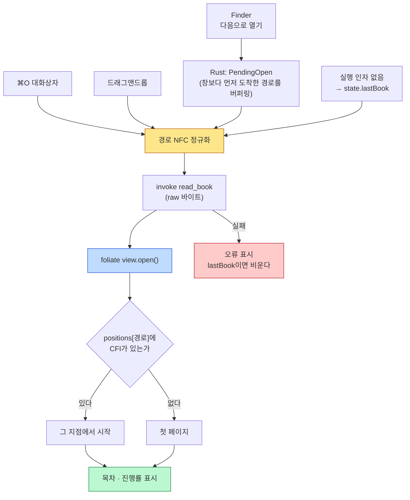

# booklet

macOS용 개인 epub 뷰어. **파일 하나를 열어 읽는 것**에만 집중한다.

Tauri v2 + vanilla TypeScript로 만들었고, 렌더링은 [foliate-js](https://github.com/johnfactotum/foliate-js)를
커밋 고정으로 벤더링해 쓴다.

## 하는 일 / 하지 않는 일

| 한다 | 하지 않는다 |
|---|---|
| epub 한 권을 열어 읽기 | 서재·장서 관리 (여러 책의 목록 화면이 없다) |
| 책마다 읽던 위치 기억 | 클라우드 동기화 |
| 마지막에 읽던 책을 그 지점에서 이어보기 | 주석·하이라이트·북마크 |
| 목차 이동, 읽기 진행률 표시 | 다크 테마·배경색 설정 |
| 타이포그래피 조절 (글꼴·크기·줄간격·자간·여백·굵기) | epub 외 포맷 (pdf는 벤더링에서 제외했다) |

책은 언제나 밖에서 들어온다 — Finder의 "다음으로 열기", 드래그앤드롭, ⌘O 대화상자.
용어와 비목표의 근거는 [`.forge/CONTEXT.md`](.forge/CONTEXT.md)에 있다.

## 설치

[릴리스](https://github.com/gyuha/booklet/releases)에서 DMG를 받아 `booklet.app`을
Applications로 끌어다 놓는다. **Apple Silicon 전용**이다.

서명 인증서가 없는 개인 빌드라 quarantine 때문에 그냥은 열리지 않는다. 받은 뒤 한 번:

```sh
xattr -dr com.apple.quarantine /Applications/booklet.app
```

Finder의 "다음으로 열기"에 노출시키려면 `task register`(또는 `task install`)를 쓴다.
**기본 앱 자리는 가져가지 않는다** — `Info.plist`의 `LSHandlerRank: Alternate`가 그것을
보장하고, 체크 C5가 매번 검증한다.

## 조작

### 키보드

| 키 | 동작 |
|---|---|
| `←` `→` | **공간 기준** 이동 — 화면의 왼쪽/오른쪽 페이지 |
| `↑` `↓` `Space` `PageUp` `PageDown` | **읽기 순서** 이동 — 글의 흐름을 따라 앞/뒤 |
| `Home` `End` | 책 전체의 처음 / 끝 |
| `⌘O` | 파일 열기 |
| `⌘T` | 목차 패널 |
| `⌘,` | 설정 패널 |
| `⌘+` `⌘-` `⌘0` | 글자 크기 키우기 / 줄이기 / 100%로 |
| `Esc` | 패널 닫기 |

RTL(오른쪽에서 왼쪽으로 흐르는) 책에서 두 기준은 방향이 반대가 된다. 좌우 방향키와
본문 좌우 클릭은 공간 기준, 나머지는 읽기 순서 기준이다.

### 마우스

- **좌우 1/3 클릭** — 공간 기준으로 페이지를 넘긴다. 가운데 1/3은 무동작(오탐 방지).
  좌우 존 위에서는 방향 화살표 커서가 뜬다.
- **휠 / 트랙패드 스와이프** — 읽기 순서로 한 장. 넘긴 뒤 300ms 동안의 델타는 흡수한다
  (관성으로 여러 장 넘어가는 것을 막는다).
- **드래그** — 10px 넘게 움직이면 페이지를 넘기지 않고 텍스트 선택으로 남긴다.
- **드래그앤드롭** — `.epub` 파일을 창에 떨어뜨리면 열린다.

### 설정

패널의 값은 전부 **전역**이다 — 책의 속성이 아니라 읽는 사람의 속성이라 책별로 갖지 않는다.

| 항목 | 범위 | 기본값 |
|---|---|---|
| 글꼴 | 리디바탕(번들) + 설치된 후보 | 리디바탕 |
| 글자 크기 | 60% – 250% | 100% |
| 줄간격 | 1.2 – 2.4 | 1.7 |
| 자간 | -0.02em – 0.1em | 0 |
| 여백 | 0 – 160px | 48px |
| 굵게 | on / off | off |

굵기가 슬라이더가 아니라 토글인 것은 실측 결과다. 번들 글꼴이 단일 웨이트라 굵기가 엔진의
합성 볼드에서 나오는데, WebKit에서 재 보니 `100·300·400`과 `600·700·900` **두 단계로만**
갈렸다 (근거는 `src/reader.ts`의 `Typography.bold`).

## 글꼴

본문 기본 글꼴은 **리디바탕**이며 앱에 함께 담겨 나간다 — 시스템에 설치하지 않아도 적용된다.
리디주식회사가 [SIL Open Font License 1.1](https://scripts.sil.org/OFL)로 배포하는 글꼴이고,
출처와 형식 변환 내역은 [`src/assets/RIDIBatang.LICENSE.md`](src/assets/RIDIBatang.LICENSE.md)에 있다.

설정 패널에서 다른 글꼴로 바꿀 수 있다. 그쪽 목록은 **시스템에 설치된 것만** 나타난다.
가용성은 캔버스 텍스트 폭 비교로 판정하며(`src/fonts.ts`), 한글만으로 된 샘플을 써서
"설치는 됐는데 한글 글리프가 없는" 글꼴도 함께 걸러낸다.

**"글꼴을 고르지 않음"은 "책 자체 글꼴을 그대로 보기"가 아니다.** 본문에는 언제나 글꼴이
주입되며, 후자는 이 앱에 없는 선택지다 (ADR `260730-001332`).

## 구조

```
src/            프론트엔드 (Tauri API를 쓰는 곳은 main.ts 뿐)
  main.ts         Tauri 배선 · 상태 · 패널 · 설정 UI
  reader.ts       foliate-js 래퍼 (Tauri 무의존 → 브라우저에서 그대로 검증된다)
  fonts.ts        글꼴 후보와 가용성 감지
  progress.ts     읽기 진행률 렌더링
  assets/         번들 글꼴 (RIDIBatang.woff2)
src-tauri/      Rust 백엔드
  src/lib.rs      커맨드 4개 + macOS "다음으로 열기" 이벤트
  src/state.rs    state.json 읽기/쓰기 (Tauri 무의존 → 단위 테스트 가능)
  Info.plist      epub 뷰어 선언 (Alternate)
vendor/         커밋 고정 foliate-js — 소스는 수정하지 않는다
scripts/        배포 · DMG · 검증 체크
```

`reader.ts`와 `state.rs`가 각각 Tauri에 의존하지 않는 것은 의도적이다. 그래야 앞쪽은
Playwright·WKWebView 하네스에서, 뒤쪽은 `cargo test`에서 앱 없이 검증할 수 있다.

### 책이 열리는 경로

세 가지 진입점이 모두 "파일 경로" 하나로 수렴한 뒤 같은 함수를 탄다. macOS가 경로를 NFD로
넘겨주므로 **NFC 정규화**가 첫 단계다 — 정규화 없이 경로를 키로 쓰면 같은 책이 두 항목으로
저장되어 위치 복원이 조용히 실패한다(한국어 파일명에서 항상).

파일 인자 없이 실행하면 `state.json`의 `lastBook`을 같은 경로로 흘려보낸다. 그 책이 지워졌거나
옮겨졌으면 `lastBook`을 비워 다음 실행에서 다시 실패하지 않게 한다.



### 영속 상태

`~/Library/Application Support/com.gyuha.booklet/state.json` 한 파일이 전부다. 페이지를
넘길 때마다 쓰지 않도록 500ms 디바운스로 모아서 저장한다.

읽기는 **절대 실패하지 않는다** — 파일이 없거나 JSON이 깨졌으면 기본값을 준다. 상태 파일이
망가졌다고 뷰어가 안 뜨는 것이 더 나쁘기 때문이다. 필드는 평평하게 두고 serde `default`에
맡겨서, 옛 `state.json`도 마이그레이션 없이 읽힌다.

## 개발

[go-task](https://taskfile.dev)가 실행·검증의 단일 진입점이다.

```sh
brew install go-task
task setup      # pnpm install + Playwright chromium + clippy
task doctor     # 필요한 도구 점검 (아무것도 설치하지 않는다)
task dev        # HMR로 앱 실행
task build      # 릴리스 빌드 → .app + dist-release/*.dmg
task run        # 빌드된 .app 실행
task --list     # 전체 목록
```

`task doctor`가 보는 것: `pnpm` `node` `cargo` `rustc` `swift` `plutil` `clippy`,
Playwright 브라우저 캐시.

`package.json`의 `dev`/`build` 스크립트는 지우면 안 된다 — `tauri.conf.json`의
`beforeDevCommand`/`beforeBuildCommand`가 직접 호출한다.

## 검증

`task check`가 스톱 조건 **C1–C9**를 전부 돌린다. 하나가 실패해도 나머지를 계속 돌리고
마지막에 실패 목록을 낸다. 개별 실행은 `task check:c3` 형태.

| | 무엇을 보는가 |
|---|---|
| **C1** | 릴리스 빌드가 되고 `.app`에 번들 글꼴이 실제로 실려 나가는가 |
| **C2** | `tsc --noEmit` + `clippy -D warnings` |
| **C3** | Chromium에서 렌더링·페이지넘김·클릭후키·휠·두번째책·위치복원·글꼴배율 |
| **C4** | 상태 영속성 단위 테스트 (왕복 / 손상 JSON / 없는 파일) |
| **C5** | epub 핸들러 등록이 무해한가 (role=Viewer, 기본 앱 자리 불변) |
| **C6** | foliate-js가 upstream 커밋 고정 벤더링인가 |
| **C7** | `.app`이 뜨고 5초를 버티는가 |
| **C8** | **실앱과 같은 엔진(WKWebView)** 에서 렌더링이 동작하는가 |
| **C9** | **실제 앱** 종단 — 이어보기·위치복원·두번째책 (`state.json` 관측) |

**체크를 건드리기 전에 [`scripts/checks/README.md`](scripts/checks/README.md)를 읽어라.**
설계 원칙 세 줄: (1) 정적 스냅샷이 아니라 조작 시퀀스를 검증한다, (2) 새 체크는 일부러
깨뜨려 실패를 확인한 뒤 채택한다, (3) 체크를 느슨하게 고쳐 통과시키지 않는다.

C3·C8·C9는 `~/Downloads`의 epub 두 개를 샘플로 쓴다. `BOOKLET_SAMPLE_EPUB` /
`BOOKLET_SAMPLE_EPUB2`로 바꿀 수 있다.

## 배포

```sh
task deploy            # patch (0.1.0 → 0.1.1)
task deploy -- minor
task deploy -- major
```

`scripts/deploy.sh`가 순서대로 한다. 게이트를 통과하지 못하면 **아무것도 건드리지 않는다**
(비파괴) — 커밋되지 않은 변경이 있거나 체크가 실패하면 거기서 멈춘다.

```
사전 점검(gh 인증 · main 브랜치 · 클린 트리 · 태그 중복) → task check
  → 버전 3파일 동기화 → 릴리스 빌드 → DMG 확인 → 커밋·태그 → 푸시 → gh release create
        ↓ 하나라도 실패
   버전 파일을 되돌리고 중단
```

버전은 `package.json` · `src-tauri/tauri.conf.json` · `src-tauri/Cargo.toml` **세 곳**에 있다.
손으로 고치지 말고 스크립트에 맡긴다.

배포 산출물은 DMG 하나이며 `hdiutil`로만 굽는다. **Tauri의 DMG 번들러는 되살리지 마라** —
`bundle_dmg.sh`가 Finder 자동화에 의존해 플레이키하고, 실패하면 마운트된 볼륨을 남긴다.

## 라이선스

개인 프로젝트라 저장소 자체에는 라이선스를 두지 않았다. 함께 배포되는 것들:

- **foliate-js** — MIT, [`vendor/foliate-js/LICENSE`](vendor/foliate-js/LICENSE).
  커밋 `78914aef`로 고정 벤더링했고 **소스는 한 줄도 수정하지 않았다**. 벤더링 사유·업데이트
  절차는 [`vendor/foliate-js/VENDOR.md`](vendor/foliate-js/VENDOR.md).
- **리디바탕** — SIL OFL 1.1, [`src/assets/RIDIBatang.LICENSE.md`](src/assets/RIDIBatang.LICENSE.md).
